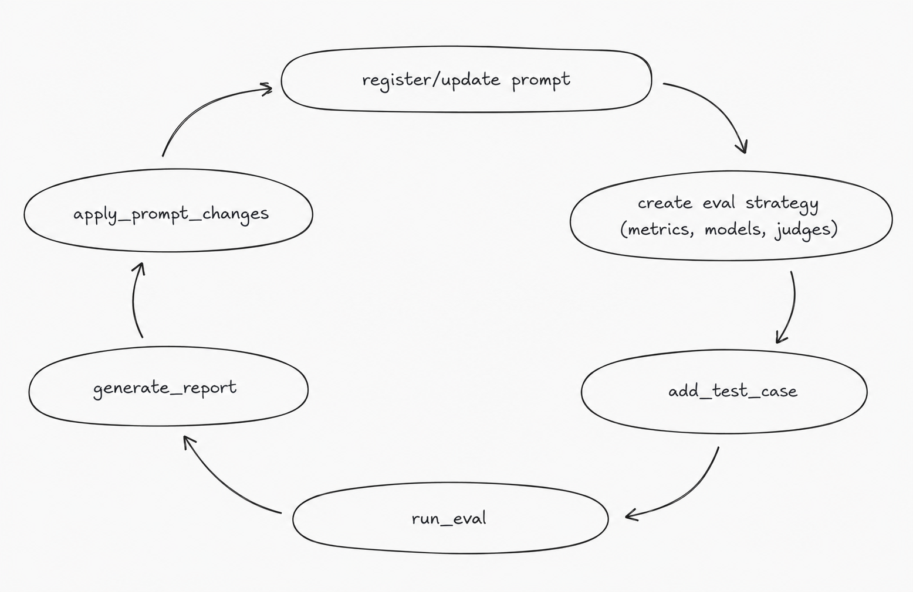

# Promptloop

An interactive CLI agent for the full prompt-eval loop: create test cases, run evals, generate reports, and approve prompt diffs without leaving your terminal.

Built on LangChain [deepagents](https://github.com/langchain-ai/deepagents).

## The Prompt Eval Loop

Agent harnesses are getting better, but prompts still shape what they do. promptloop turns a prompt and eval intent into a repeatable loop:



It saves the methodology, test cases, reports, prompt history, and chat checkpoints under `.evals/` in the target project.

```text
.evals/
  prompts/        # registered prompts + version history
  test_cases/     # per-prompt test suites
  eval_configs/   # methodology (metrics, models, judges)
  results/        # eval runs and reports
  chat.db         # SQLite checkpoint of conversation threads
```

Example metrics:

- `latency`: response time
- `json_schema`: validates structured output
- `fuzzy_match`: compares text similarity
- `llm_judge`: scores output with a judge prompt

## Quick Demo

Suppose your project has a prompt at `prompts/summarize.md`:

```text
Summarize the user's note in three bullets.
Return JSON.
```

Start promptloop and describe the behavior you want to test:

```text
$ uv run promptloop --project-dir ~/work/notes-app

promptloop> Evaluate the prompt at prompts/summarize.md.

Registered prompt 'summarize' (v1)
Source: /Users/me/work/notes-app/prompts/summarize.md

promptloop> Add a test case where the note includes action items, dates, and unrelated chatter.

Added test case 'tc_action_items' for prompt 'summarize'
(metrics: json_schema, llm_judge).

promptloop> Run the eval.

Run complete - ID: run_20260529_091214_a3f2
Results: 2 passed / 1 failed / 3 total
Avg latency: 1840ms
Max concurrency: 3

  passed [tc_basic_summary] anthropic:claude-sonnet-4-6
    json_schema: valid JSON matching schema | llm_judge: 0.86
  failed [tc_action_items] anthropic:claude-sonnet-4-6
    json_schema: schema mismatch: 'action_items' is a required property
  passed [tc_noise] anthropic:claude-sonnet-4-6
    json_schema: valid JSON matching schema | llm_judge: 0.82
```

Ask for a fix, and promptloop proposes a diff instead of editing blindly:

```text
promptloop> Propose a prompt change for the failing action-items case.

Proposed changes to 'summarize' from v1:
```

```diff
--- summarize (current)
+++ summarize (proposed)
@@
-Summarize the user's note in three bullets.
-Return JSON.
+Summarize the user's note in three bullets.
+If the note contains follow-up tasks, extract them into an action_items array.
+Each action item should include a task, owner if mentioned, and due_date if mentioned.
+
+Return only valid JSON with this shape:
+{
+  "summary": ["...", "...", "..."],
+  "action_items": [
+    {"task": "...", "owner": "...", "due_date": "..."}
+  ]
+}
```

It also generates a report you can inspect before approving the change:

```markdown
# Prompt Eval Report: summarize

**Run:** run_20260529_091214_a3f2
**Models:** anthropic:claude-sonnet-4-6
**Pass rate:** 67% (2/3)
**Avg latency:** 1840ms

## Failure Analysis

The action-items case failed because the prompt only requested "three bullets"
and "JSON"; it did not define a required JSON shape or explain how to handle
dates, owners, and follow-up tasks.

## Recommendations

1. Add an explicit `action_items` field to the schema.
2. Tell the model to preserve due dates and owners when present.
3. Require JSON-only output so downstream parsing is stable.
```

## Install and Run

```bash
git clone <this repo>
cd promptloop
uv sync
uv run promptloop --project-dir /path/to/your/project
```

You'll get an interactive chat. Try things like:

- *"Evaluate the prompt at `src/prompts/summarize.txt`"*
- *"Add three more test cases for edge cases"*
- *"Re-run with `openai:gpt-4o-mini` and compare to the last run"*
- *"Propose a fix for the failing JSON schema cases"*

## Commands

| Command | Description |
| --- | --- |
| `/help` | Show help |
| `/clear` | Start a new conversation thread |
| `/threads` | List saved threads |
| `/thread <id>` | Switch to a thread in-session |
| `/quit` | Exit |

Resume past sessions with `promptloop --thread <id>`. Press **Esc** to interrupt a streaming response.

## How It Works

The agent has a small set of typed tools on top of deepagents' filesystem access:

- `register_prompt`, `propose_prompt_changes`, `apply_prompt_changes`, `show_prompt_history`
- `add_test_case`, `infer_json_schema`, `save_eval_config`
- `run_eval`, `list_eval_runs`
- `generate_report`, `read_report`, `compare_runs`

For more detail on the agent runtime behind this project, see [The Harness Behind Deep Agent](docs/The_Harness_Behind_Deep_Agent.md).

Early / experimental. Feedback and issues welcome.
