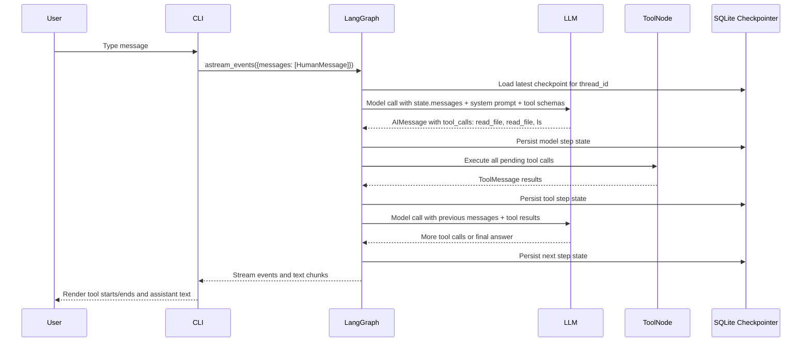
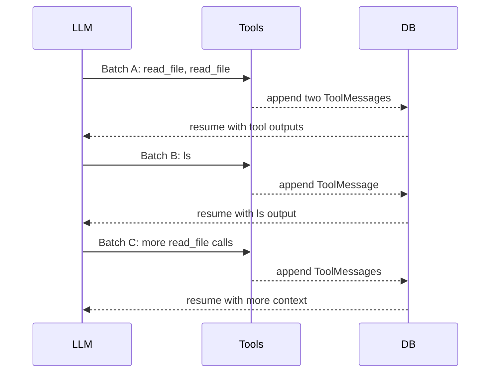

# Inside LangChain's Deepagents: The Harness Behind Multi-Tool Agents

I recently dug into LangChain's `deepagents` framework while building the prompt loop CLI. The interesting part was not just "the agent can call tools." The interesting part was the harness around the model: the graph, middleware, state channels, tool router, and checkpoint system that make a long-running agent feel like a single conversation.

This article is a deep dive into that harness. The goal is to answer two practical questions:

1. What are the moving pieces inside a Deep Agent? What's the harness behind multi-tool agents?
2. While building this, one question came to my mind: tool runnings are fast, but tools + llm together with multiple turns still feel slow to me. How to orchestrate tool calls with llm better to maximium token and time usage. I guess this is the question of 'what is a good harness to make the loop smooth'.

## 1. The Harness

At the highest level, `deepagents` is a policy and middleware layer on top of LangChain's `create_agent()`, which compiles down to a LangGraph `StateGraph`.

The model is not running alone. It sits inside a loop:

```text
model -> router -> tools -> router -> model -> ...
```

The framework manages:

- which tools are available;
- how tool calls are executed;
- what state survives between turns;
- how old context is summarized;
- how large tool results are offloaded;
- how the graph resumes from a previous thread.

In my local setup, the agent is created roughly like this:

```python
model = init_chat_model("anthropic:claude-sonnet-4-6", temperature=0)

backend = FilesystemBackend(
    root_dir=str(project_dir),
    virtual_mode=False,
)

agent = create_deep_agent(
    model=model,
    tools=custom_eval_tools,
    system_prompt=SYSTEM_PROMPT,
    checkpointer=AsyncSqliteSaver(...),
    backend=backend,
)
```

That single call hides quite a lot.

## 2. Deepagents Is Mostly Middleware

`create_deep_agent()` does not manually build every LangGraph node itself. It prepares a model, tools, backend, prompt, and middleware stack, then delegates to LangChain's `create_agent()`.

The default deepagents stack includes:

- `TodoListMiddleware`: gives the agent a `write_todos` planning tool and stores `todos` in state.
- `MemoryMiddleware` (optional): loads `AGENTS.md` files and injects their content into the system prompt. Only added when `memory=` is passed.
- `SkillsMiddleware` (optional): loads skill definitions from the backend and injects them into the system prompt. Only added when `skills=` is passed.
- `FilesystemMiddleware`: adds `ls`, `read_file`, `write_file`, `edit_file`, `glob`, `grep`, and sometimes `execute`.
- `SubAgentMiddleware`: adds the `task` tool for launching isolated subagents. Always includes a built-in general-purpose subagent unless you define one with the same name.
- Summarization middleware: compacts long conversations and can offload old history to the backend.
- Anthropic prompt caching middleware: applies provider-specific prompt caching behavior when supported.
- `PatchToolCallsMiddleware`: repairs dangling tool calls if execution is interrupted.
- `AsyncSubAgentMiddleware` (optional): adds tools for launching and managing background subagents on a remote LangGraph server. Only added when `async_subagents=` is passed.
- `HumanInTheLoopMiddleware` (optional): interrupts the graph for human approval. Only added when `interrupt_on=` is passed.

Then LangChain's `create_agent()` turns that into a graph with a model node, a tools node, and conditional edges between them. Middleware is not a separate node — each middleware layer wraps the model call inside the agent node via `wrap_model_call()`, invisible to LangGraph's graph structure.

One thing `create_deep_agent()` also does that is easy to miss: it always appends its own `BASE_AGENT_PROMPT` to whatever system prompt you provide. Your prompt comes first; deepagents' behavioral guidelines ("Be concise and direct. Don't over-explain...") follow. So the model always sees both, regardless of what you pass.

The core idea: tools are not just Python functions bolted onto an LLM. They are part of a graph runtime with state, routing, persistence, and middleware hooks.

## 3. Tool Registration

Tools enter the system from two places.

First, your application can pass custom tools. These are the tools I created for my prompt eval agent which can register, evaluate, run test and improve the prompt. 

```python
tools = [
    *make_prompt_tools(project_dir),
    *make_test_case_tools(project_dir),
    *make_runner_tools(project_dir),
    *make_report_tools(project_dir),
]
```

Second, middleware contributes tools. For example, the filesystem middleware adds file tools, the todo middleware adds `write_todos`, and the subagent middleware adds `task`.

LangChain collects these into a `ToolNode`. Before each model call, the model is bound to the current tool schemas. The tool Python functions are not recreated each time. Whether `execute` is included is decided once at middleware initialization time — `FilesystemMiddleware` checks `isinstance(backend, SandboxBackendProtocol)` when it is created, and either adds or omits the `execute` tool permanently. The tool set is fixed for the lifetime of the agent.

One naming caveat: `grep` in deepagents is **literal text search**, not regex. It searches for exact string matches in files. If you want regex, you would need a custom tool.

### Large Tool Result Eviction

There is a less obvious part of tool routing that matters a lot in practice. `FilesystemMiddleware` intercepts every tool result in `wrap_tool_call()`. If the result text exceeds roughly 20,000 tokens (configurable), the middleware automatically:

1. Writes the full content to `/large_tool_results/{tool_call_id}` via the backend.
2. Replaces the result in the message with a truncated head+tail preview and a note telling the model to use `read_file` if it needs the rest.

The model is told this in its system prompt:

> When a tool result is too large, it may be offloaded into the filesystem instead of being returned inline. In those cases, use `read_file` to inspect the saved result in chunks.

This is completely automatic. You do not need to design tools to return small payloads to avoid blowing up the context — the framework will evict large results for you. The tools excluded from eviction are the file tools themselves (`ls`, `glob`, `grep`, `read_file`, `edit_file`, `write_file`), since it would not make sense to evict the result of a file read that the model is trying to retrieve.

## 4. Multi-Turn Conversation Timeline

This is the most important mental model. A single user message can trigger several internal model/tool cycles.




The key detail: the model can emit multiple tool calls in a single `AIMessage`.

For example, one model turn might request:

```text
read_file(...)
read_file(...)
ls(...)
```

The `ToolNode` can execute those pending calls as one batch. After the tool results are appended to state, the graph usually returns to the model. The model reads the tool results and decides the next action.

So the loop is:

```text
LLM turn -> zero or more tools -> LLM turn -> zero or more tools -> ...
```

Not necessarily:

```text
LLM turn -> one tool -> LLM turn
```

That distinction matters for both latency and cost.

## 5. What Is Agent State?

The graph is stateful. The state is not just the latest chat message. It is the working memory the graph carries between nodes and checkpoints.

The base LangChain agent state includes:

- `messages`: user messages, assistant messages, tool calls, and tool results.
- `structured_response`: optional structured output when a response schema is configured via `response_format=`.

Deepagents middleware adds more:

- `todos`: the current todo list from `TodoListMiddleware`.
- `files`: virtual filesystem state and file updates from `FilesystemMiddleware`.
- `_summarization_event`: private metadata about conversation compaction.
- `memory_contents`: private memory content if `MemoryMiddleware` is enabled.
- `skills_metadata`: private skill metadata if `SkillsMiddleware` is enabled.
- `async_subagent_jobs`: job tracking dict if `AsyncSubAgentMiddleware` is enabled.

The "private" fields (`memory_contents`, `skills_metadata`, `_summarization_event`) are annotated with `PrivateStateAttr` in the source. Private fields are excluded from both parent state and checkpointing entirely. They are reloaded from the backend on each turn — that is why memory middleware re-reads AGENTS.md files fresh on every model call rather than restoring them from a checkpoint.

The biggest state key is almost always `messages`.

Every file read, tool result, eval report, error, and assistant message can become part of `messages`. That is why long-running agent threads grow heavy over time.

## 6. State Snapshot Shape

Conceptually, a checkpointed state can look like this:

```json
{
  "messages": [
    {"type": "human", "content": "Evaluate this prompt"},
    {
      "type": "ai",
      "content": "",
      "tool_calls": [
        {"id": "call_1", "name": "read_file", "args": {"path": "/repo/prompt.md"}},
        {"id": "call_2", "name": "ls", "args": {"path": "/repo/.evals"}}
      ]
    },
    {
      "type": "tool",
      "name": "read_file",
      "tool_call_id": "call_1",
      "content": "..."
    },
    {
      "type": "tool",
      "name": "ls",
      "tool_call_id": "call_2",
      "content": "..."
    },
    {"type": "ai", "content": "I found the prompt and test cases..."}
  ],
  "todos": [
    {"content": "Read prompt", "status": "completed"}
  ],
  "files": {},
  "_summarization_event": null
}
```

The real state is richer than this. It includes LangChain message objects, provider metadata, checkpoint metadata, channel versions, pending writes, and task identifiers. But this shape captures the important part: the graph is carrying a transcript of both conversation and computation.

## 7. Checkpointing

When you use a LangGraph checkpointer, each thread can be resumed by `thread_id`.

With SQLite, the checkpointer stores two main kinds of data:

- `checkpoints`: serialized snapshots keyed by `thread_id`, namespace, and checkpoint id.
- `writes`: intermediate channel writes associated with graph tasks.

This gives you durable conversation state, but it also means long conversations can create large checkpoint histories.

Checkpointing is useful because an agent can survive restarts and resume work. It is costly because every graph step may serialize state that includes growing message history.

One implementation detail: deepagents sets a recursion limit of 1000 on the compiled graph via `.with_config()`. This is the maximum number of graph steps (model + tool nodes combined) before LangGraph raises an error. Your application config can override this — the CLI in this project sets 100.

## 8. Why I Saw my Multi-Tool Runs Feel Slow

At the very first, when I saw my terminal stream like this:

```text
-> read_file
-> read_file ✓ ✓
-> ls ✓
-> read_file ✓
```

it was tempting to blame the tools.

But local tools like `ls` and `read_file` are usually fast. The latency usually may come from the model/tool loop around them.




Each batch has overhead:

- another model call;
- tool result serialization;
- checkpoint writes;
- larger message history on the next model request;
- more routing and middleware work.

The tool might take 20 ms. The model turn around it might take several seconds.

That is the hidden cost of agentic orchestration.

## 9. The Core Design Problem

The hard part of building a tool-using agent is not "can it call a tool?"

The problem I ran into was more specific: the tools were not slow, but the run still felt slow. The bottleneck was the orchestration around the tools: repeated model turns, growing state, and checkpointed tool results.

That makes harness design the real problem. The hard part is controlling how often the agent returns to the model, how much context each tool returns, and how much state you carry forward.

A good harness should manage three budgets:

1. Model turns.
2. Tool output size.
3. Persistent state growth.

If you ignore those budgets, the agent still works, but it starts to feel slow and expensive.

The model may call one tool, read the result, call another tool, read the result, call another tool, and so on. That is sometimes necessary. But often the model could have batched independent reads or searched more precisely.

The framework gives you the plumbing. Your job is to shape the behavior.

## 10. Practical Ways To Reduce Cost and Latency

These are the optimizations I've tried to reduce unnecessary model/tool loops:

- Encourage batched tool calls when the reads are independent.
- Avoid returning huge raw tool payloads when a summary or filtered result is enough.
- Clean up context when old context is no longer useful.
- Store large artifacts outside `messages` and reference them by path. Note: `FilesystemMiddleware` already does this automatically for any tool result over ~20K tokens — so the eviction budget is handled for you, but you still pay for the model turns that read those evicted files back.
- Use a faster orchestrator model, it may not need to be the smartest model but works well for your use case.

The most important one: design tools that return decision-ready output.

## 11. Final Takeaway


Think of Deep Agents as a runtime harness:

```text
LLM reasoning
  + tool schemas
  + graph routing
  + middleware
  + state channels
  + checkpointing
  + summarization
  + filesystem / backend storage
```

The LLM is only one part of the system. The harness decides what the LLM sees, what tools it can call, how results are stored, when control returns to the model, and how the conversation survives over time.

LangChain's `deepagents` framework is powerful because it turns agent behavior into a layered harness over LangGraph.

Designing good agents means designing the loop intentionally: batch tools when possible, keep tool outputs small, manage checkpointed state, and make each model turn count.

The power comes from the loop.
