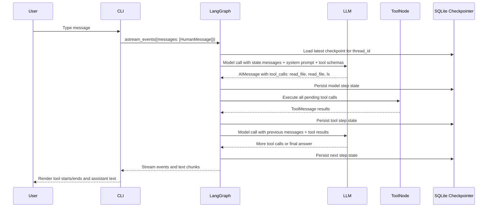

# Inside LangChain's Deepagents: The Harness Behind Multi-Tool Agents

I recently dug into LangChain's `deepagents` framework while building the prompt loop CLI. The interesting part was not just "the agent can call tools." The interesting part was the harness around the model: the graph, middleware, state channels, tool router, and checkpoint system that make a long-running agent feel like a single conversation.

Here is a deep dive into that harness. The goal is to answer two practical questions:

1. What are the moving pieces inside a Deep Agent? What's the harness behind multi-tool agents?
2. While building this, one question came to me: when running multiple tool callings, llm + tools together with multiple turns feel slow to me. 'How to orchestrate tool calls with llm better to maximium token and time usage?' I guess this is the question of 'what is a good harness to make the loop smooth'.

## 1. The Harness

At the highest level, `deepagents` is a policy and middleware layer on top of LangChain's `create_agent()`, which compiles down to a LangGraph `StateGraph`.

The model is not running alone. It sits inside a loop:

```text
model -> router -> tools -> router -> model -> ...
```

The framework manages:

- which tools are available;
- how tool calls are executed;
- what state survives between turns;
- how old context is summarized;
- how large tool results are offloaded;
- how the graph resumes from a previous thread.

In my local setup, the agent is created roughly like this:

```python
model = init_chat_model("anthropic:claude-sonnet-4-6", temperature=0)

backend = FilesystemBackend(
    root_dir=str(project_dir),
    virtual_mode=False,
)

agent = create_deep_agent(
    model=model,
    tools=custom_eval_tools,
    system_prompt=SYSTEM_PROMPT,
    checkpointer=AsyncSqliteSaver(...),
    backend=backend,
)
```

## 2. Deepagents Is a Middleware Stack

`create_deep_agent()` is the main entry point — the call that turns a model, tools, backend, and prompt into a running agent. It does not build the execution graph from scratch; it assembles those pieces into a middleware stack, then hands them off to a factory that compiles everything into a runnable loop.

The default stack includes:

- `TodoListMiddleware`: adds a `write_todos` planning tool; stores the todo list in state.
- `FilesystemMiddleware`: adds file tools (`ls`, `read_file`, `write_file`, `edit_file`, `glob`, `grep`) and optionally `execute`.
- `SubAgentMiddleware`: adds a `task` tool for launching isolated subagents.
- Summarization: compacts long conversations and offloads old history to the backend.
- Prompt caching: applies provider-specific caching when supported.
- `PatchToolCallsMiddleware`: repairs incomplete tool calls if execution is interrupted.
- `MemoryMiddleware` *(optional)*: injects `AGENTS.md` content into the system prompt.
- `SkillsMiddleware` *(optional)*: injects skill definitions into the system prompt.
- `AsyncSubAgentMiddleware` *(optional)*: adds tools for managing background subagents.
- `HumanInTheLoopMiddleware` *(optional)*: pauses the graph for human approval.

Middleware is not a separate graph node. Each layer wraps the model call invisibly — the execution graph just sees a model node and a tools node with routing between them. The core idea: tools are not just functions bolted onto an LLM. They are part of a graph runtime with state, routing, persistence, and middleware hooks.

### How a Turn Flows

A single user message can trigger several internal model/tool cycles.



The model can emit multiple tool calls in a single response. One turn might request:

```text
read_file(...)
read_file(...)
ls(...)
```

Those execute as one batch. After the results are appended to state, control returns to the model. So the loop is:

```text
LLM turn -> zero or more tools -> LLM turn -> zero or more tools -> ...
```

That distinction matters for both latency and cost.

## 3. Tools, State, and Persistence

### Tool Registration

Tools enter the system from two places.

First, your application can pass custom tools. These are the tools I created for my prompt eval agent which can register, evaluate, run test and improve the prompt.

```python
tools = [
    *make_prompt_tools(project_dir),
    *make_test_case_tools(project_dir),
    *make_runner_tools(project_dir),
    *make_report_tools(project_dir),
]
```

Second, middleware contributes tools — filesystem middleware adds file tools, todo middleware adds `write_todos`, subagent middleware adds `task`.

All tools are collected before the agent starts. The tool set is fixed for its lifetime; `execute` is included or omitted at initialization based on the backend type and never toggled after that.

One caveat: `grep` here is literal text search, not regex.

#### Large Tool Result Eviction

There is a less obvious part of tool routing that matters a lot in practice. `FilesystemMiddleware` intercepts every tool result in `wrap_tool_call()`. If the result text exceeds roughly 20,000 tokens (configurable), the middleware automatically:

1. Writes the full content to `/large_tool_results/{tool_call_id}` via the backend.
2. Replaces the result in the message with a truncated head+tail preview and a note telling the model to use `read_file` if it needs the rest.

The model is told this in its system prompt:

> When a tool result is too large, it may be offloaded into the filesystem instead of being returned inline. In those cases, use `read_file` to inspect the saved result in chunks.

### Agent State

The agent carries state between every node and checkpoint — not just the latest message, but everything the graph needs to continue:

- `messages`: the full transcript — user input, assistant replies, tool calls, tool results.
- `todos`: the current todo list.
- `files`: filesystem state from `FilesystemMiddleware`.
- `async_subagent_jobs`: background job tracking, if enabled.

Some fields — `memory_contents`, `skills_metadata`, `_summarization_event` — are private and never checkpointed. They reload from the backend each turn, which is why memory middleware re-reads `AGENTS.md` fresh on every model call instead of restoring it from a snapshot.

The dominant key by far is `messages`. Every tool call, result, and reply accumulates there — which is why long-running threads grow heavy over time.

Conceptually, a checkpointed state can look like this:

```json
{
  "messages": [
    {"type": "human", "content": "Evaluate this prompt"},
    {
      "type": "ai",
      "content": "",
      "tool_calls": [
        {"id": "call_1", "name": "read_file", "args": {"path": "/repo/prompt.md"}},
        {"id": "call_2", "name": "ls", "args": {"path": "/repo/.evals"}}
      ]
    },
    {
      "type": "tool",
      "name": "read_file",
      "tool_call_id": "call_1",
      "content": "..."
    },
    {
      "type": "tool",
      "name": "ls",
      "tool_call_id": "call_2",
      "content": "..."
    },
    {"type": "ai", "content": "I found the prompt and test cases..."}
  ],
  "todos": [
    {"content": "Read prompt", "status": "completed"}
  ],
  "files": {},
  "_summarization_event": null
}
```

The real state is richer than this — it includes provider metadata, channel versions, pending writes, and task identifiers. But this shape captures the important part: the graph is carrying a transcript of both conversation and computation.

### Checkpointing

Each conversation thread is keyed by `thread_id` and can be resumed after a restart. Every graph step writes a snapshot — useful for durability, costly because state grows with message history.

One detail worth knowing: deepagents sets a default recursion limit of 1000 graph steps before raising an error. The CLI in this project overrides it to 100.

## 4. Why Runs Feel Slow — and What to Do About It

At the very first, when I saw my terminal stream like this:

```text
-> read_file
-> read_file ✓ ✓
-> ls ✓
-> read_file ✓
```

The flow was really slow — I was tempting to blame the tools.

But local tools like `ls` and `read_file` are usually fast. The latency comes from the model/tool loop around them.

Each batch has overhead:

- another model call;
- tool result serialization;
- checkpoint writes;
- larger message history on the next model request;
- more routing and middleware work.

The tool might take 20 ms. The model turn around it might take several seconds. That is the hidden cost of agentic orchestration.

The bottleneck is not the tools — it is how often the agent returns to the model, how much context each tool returns, and how much state you carry forward. A good harness manages three budgets:

1. Model turns.
2. Tool output size.
3. Persistent state growth.

To reduce unnecessary model/tool loops:

- Encourage batched tool calls when reads are independent.
- Avoid returning huge raw payloads when a summary or filtered result is enough.
- Store large artifacts outside `messages` and reference them by path. (`FilesystemMiddleware` already does this automatically for results over ~20K tokens, but you still pay for the model turns that read those files back.)
- Use a faster orchestrator model — it doesn't need to be the smartest, just effective for your use case.

The most important one: design tools that return decision-ready output.

## 5. Final Takeaway

Think of Deep Agents as a runtime harness:

```text
LLM reasoning
  + tool schemas
  + graph routing
  + middleware
  + state channels
  + checkpointing
  + summarization
  + filesystem / backend storage
```

The LLM is only one part of the system. The harness decides what the LLM sees, what tools it can call, how results are stored, when control returns to the model, and how the conversation survives over time.

Designing good agents means designing the loop intentionally: batch tools when possible, keep tool outputs small, manage checkpointed state, and make each model turn count.

The power comes from the loop.
