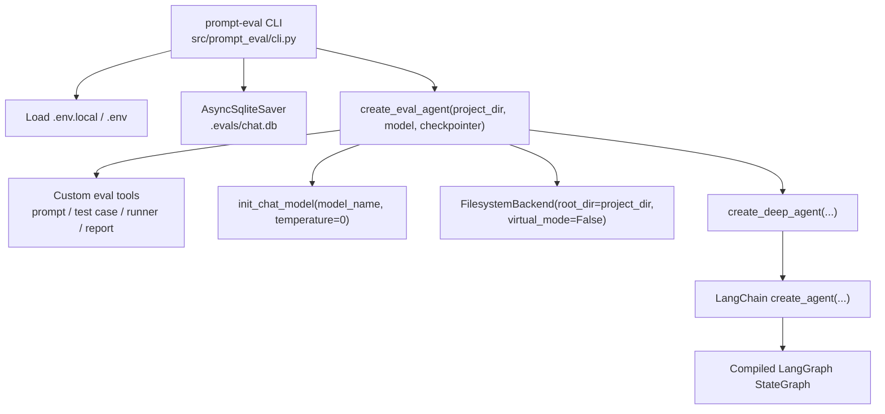
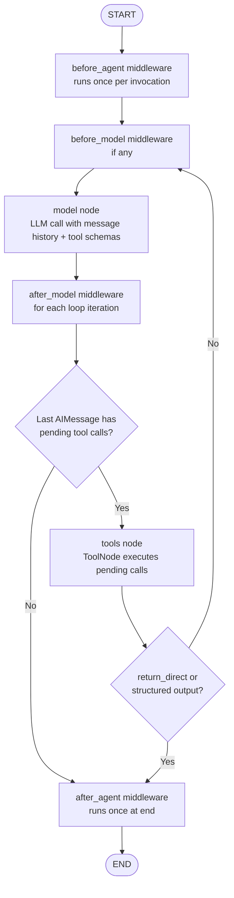
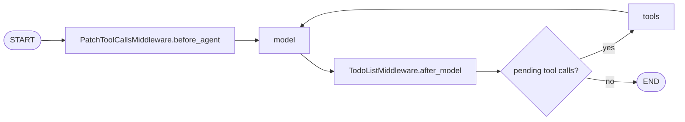
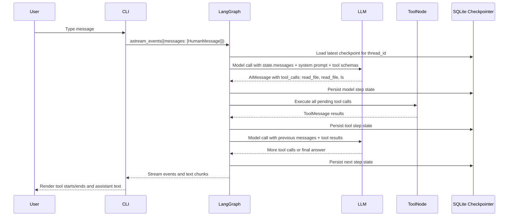
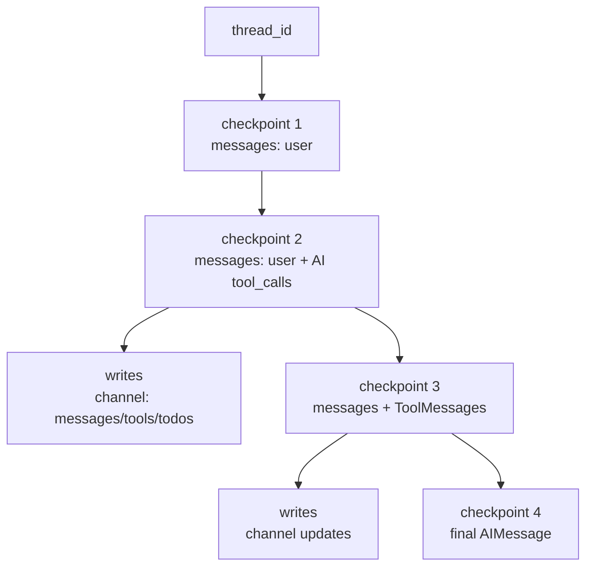
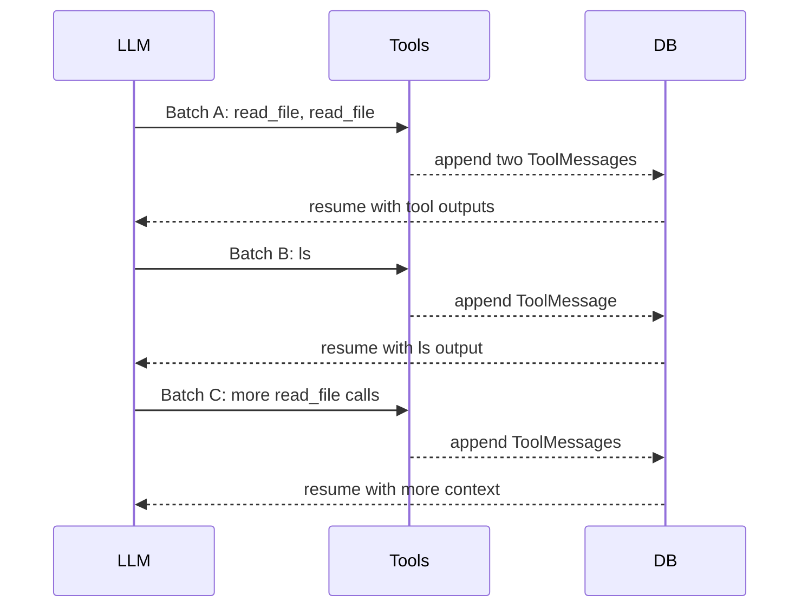

# Deepagents and LangGraph Runtime Architecture

This document explains how the current `prompt-eval` agent is assembled and how a deepagents/LangGraph conversation runs across LLM calls, tool calls, middleware, state, and SQLite checkpointing.

The analysis is based on this repo's agent wiring in `src/prompt_eval/agent.py` and `src/prompt_eval/cli.py`, plus the local editable deepagents source at `../deepagents/libs/deepagents` and the installed LangChain/LangGraph packages in `.venv`.

## Current Prompt Eval Wiring

`prompt-eval` creates one compiled graph per CLI process. The graph is reused for each user turn, while `thread_id` selects which persisted conversation state to resume.



The project-specific custom tool list comes from:

- `make_prompt_tools(project_dir)`
- `make_test_case_tools(project_dir)`
- `make_runner_tools(project_dir)`
- `make_report_tools(project_dir)`

Deepagents adds its own middleware tools around those custom tools. In the current compiled graph, inspection showed these graph nodes:

- `PatchToolCallsMiddleware.before_agent`
- `model`
- `TodoListMiddleware.after_model`
- `tools`

The currently compiled graph channels are:

- `messages`
- `todos`
- `files`
- `_summarization_event`
- `jump_to`
- `structured_response`

The branch/task channels used internally by LangGraph also exist, such as `branch:to:model`, `branch:to:tools`, and `__pregel_tasks`.

## Middleware Stack

`create_deep_agent()` builds a middleware stack and then passes it to LangChain's `create_agent()`.

For this project, no custom `memory`, `skills`, `async_subagents`, or extra `middleware` are passed. The main agent stack is therefore:

1. `TodoListMiddleware()`
2. `FilesystemMiddleware(backend=FilesystemBackend(...))`
3. `SubAgentMiddleware(...)`
4. `create_summarization_middleware(model, backend)`
5. `AnthropicPromptCachingMiddleware(unsupported_model_behavior="ignore")`
6. `PatchToolCallsMiddleware()`

The general-purpose subagent created by deepagents receives a similar default stack. Your system prompt explicitly says not to use the `task` tool, but the middleware still creates the task/subagent capability unless removed from the framework stack.

## Tool Registration

There are two categories of tools:

- Client-side tools registered in LangChain's `ToolNode`.
- Provider-native tools represented as dicts and sent directly to the model provider.

In this project, the relevant tools are client-side tools. LangChain's agent factory creates a `ToolNode` from:

- middleware tools, such as `write_todos`, `ls`, `read_file`, `write_file`, `edit_file`, `glob`, `grep`, and `task`;
- custom tools from `src/prompt_eval/tools/*`.

The model is bound to the same tool set before each model call through `model.bind_tools(...)`. That does not mean each tool is recreated per call; it means each LLM request includes the tool schema so the model can choose tool calls.

## High-Level Agent Loop

The core runtime shape is:



For the current compiled graph, the practical loop is:



The important part: tools normally do not decide the next semantic step themselves. Tools produce `ToolMessage` results; then the graph returns to the LLM so the model can inspect those results and choose the next action.

## Multi-Turn Conversation Timeline

One user message can contain many internal graph steps.



A single LLM response may request several tools at once. Those tools can be sent to the `tools` node as multiple `Send("tools", ToolCallWithContext(...))` tasks. After those tool calls finish, the graph routes back to the model once with all resulting `ToolMessage` entries present in `messages`.

So the loop is best understood as:

```text
LLM turn -> zero or more tool calls -> LLM turn -> zero or more tool calls -> ...
```

It is not necessarily:

```text
LLM turn -> exactly one tool -> LLM turn
```

Multiple tools can run between two LLM turns when the model emitted multiple tool calls in one `AIMessage`.

## Conditional Routing Details

LangChain's `create_agent()` builds conditional edges around two functions:

- `_make_model_to_tools_edge(...)`
- `_make_tools_to_model_edge(...)`

### Model to Tools

After the model node, the router inspects the latest `AIMessage`.

It exits when:

- there is no latest `AIMessage`;
- the latest `AIMessage` has no tool calls;
- a `structured_response` is already present.

It goes to `tools` when:

- the latest `AIMessage` contains tool calls that do not yet have matching `ToolMessage` results;
- those tool calls are not structured-output pseudo-tools.

It can also obey `jump_to` if middleware writes an explicit routing directive.

### Tools to Model

After the tools node, the router normally returns to the model. It exits early only when:

- all executed client-side tools are `return_direct=True`;
- a structured output tool was executed.

Otherwise it routes back to the loop entry, which is usually `before_model` if present or `model` directly.

That is why every meaningful batch of tool results usually triggers another LLM call: the model must read the tool outputs and decide whether it is done, needs more context, or should call a different tool.

## What State Means

LangChain's base `AgentState` contains:

- `messages`: the conversation and tool transcript. It uses the `add_messages` reducer, so each node can append new messages instead of replacing the whole list.
- `jump_to`: an ephemeral/private routing control field used by middleware to force routing to `tools`, `model`, or `end`.
- `structured_response`: optional structured output value when the agent is configured with a response schema.

Deepagents and LangChain middleware extend this state.

### `messages`

This is usually the largest and most important state key. It contains:

- `HumanMessage` entries from the user.
- `SystemMessage` is used in model requests, but the agent state channel primarily carries the conversation messages.
- `AIMessage` entries from the LLM, including `tool_calls`.
- `ToolMessage` entries produced by `ToolNode`.

An `AIMessage` with tool calls typically contains:

- natural language text, sometimes empty;
- `tool_calls`, each with an `id`, `name`, and `args`;
- provider metadata and response metadata.

A corresponding `ToolMessage` contains:

- `tool_call_id`, matching the AI tool call id;
- `name`, the tool name;
- `content`, the returned string or content blocks;
- status and metadata.

This is the key that makes long threads expensive. File reads, eval results, report JSON, and error messages all become part of `messages` unless summarized, trimmed, or offloaded.

### `todos`

`TodoListMiddleware` adds `todos`.

This powers the `write_todos` tool and lets the model maintain a task list across internal steps. In the state schema it is marked as omitted from input, meaning callers do not provide it directly as normal user input. The graph maintains it as part of the agent state.

### `files`

`FilesystemMiddleware` adds `files`.

This key is most important when the backend is `StateBackend`, where virtual file contents live in graph state. Your project passes `FilesystemBackend(root_dir=project_dir, virtual_mode=False)`, so normal file operations read and write the real filesystem. However, the middleware still has a `files` channel because the state schema includes it and because large tool-result eviction can create `files_update` values.

The filesystem middleware can offload large tool messages to `/large_tool_results/<tool_call_id>`. The original large `ToolMessage` is replaced with a smaller message pointing to that path. This protects the model context window, but the graph still needs enough state to know about those file updates.

### `_summarization_event`

Deepagents' summarization middleware adds `_summarization_event` as a private field.

The middleware computes defaults from the model profile. When model profile data includes max input tokens, defaults are fraction-based:

- trigger at about `0.85` of context;
- keep about `0.10` of context;
- truncate large old tool-call arguments at a similar threshold.

When profile data is not available, fallback defaults are more conservative:

- summarize at about `170000` tokens;
- keep about `6` messages;
- trigger argument truncation around `20` messages and keep the last `20`.

When summarization runs, older messages are summarized by an LLM call, and the full evicted history can be written through the configured backend under `/conversation_history/{thread_id}.md`.

### `structured_response`

This appears when a response format is configured. Your `prompt-eval` agent currently does not pass `response_format`, so this is usually absent.

When it is present, it can change routing: structured output tools can cause the graph to exit instead of returning to the normal model/tool loop.

### `jump_to`

`jump_to` is a private/ephemeral routing field. Middleware nodes can set it to direct the graph to:

- `tools`
- `model`
- `end`

The router resolves it before normal edge logic. It is a control signal, not user-visible conversation content.

### Private Memory and Skill State

These are not active in your current `prompt-eval` construction unless you pass `memory=` or `skills=`, but deepagents supports them:

- `memory_contents`: loaded `AGENTS.md` file contents from `MemoryMiddleware`.
- `skills_metadata`: parsed `SKILL.md` metadata from `SkillsMiddleware`.

Both are private state fields and are explicitly excluded when subagents exchange state with parent agents.

## State Snapshot Shape

Conceptually, a checkpointed state can look like this:

```json
{
  "messages": [
    {"type": "human", "content": "Evaluate this prompt"},
    {
      "type": "ai",
      "content": "",
      "tool_calls": [
        {"id": "call_1", "name": "read_file", "args": {"path": "/repo/prompt.md"}},
        {"id": "call_2", "name": "ls", "args": {"path": "/repo/.evals"}}
      ]
    },
    {
      "type": "tool",
      "name": "read_file",
      "tool_call_id": "call_1",
      "content": "..."
    },
    {
      "type": "tool",
      "name": "ls",
      "tool_call_id": "call_2",
      "content": "..."
    },
    {"type": "ai", "content": "I found the prompt and test cases..."}
  ],
  "todos": [
    {"content": "Read prompt", "status": "completed"}
  ],
  "files": {},
  "_summarization_event": null
}
```

The real serialized data includes richer Python/LangChain message objects, provider metadata, channel versions, pending writes, task identifiers, and checkpoint metadata.

## Checkpointing in SQLite

The CLI uses:

```python
AsyncSqliteSaver.from_conn_string(str(project_dir / ".evals" / "chat.db"))
```

The active thread is passed as:

```python
config = {
    "configurable": {"thread_id": thread_id},
    "recursion_limit": RECURSION_LIMIT,
}
```

SQLite stores checkpoints in two main tables:

- `checkpoints`: full checkpoint snapshots keyed by `thread_id`, `checkpoint_ns`, and `checkpoint_id`.
- `writes`: intermediate channel writes associated with a checkpoint and task id.

The `checkpoints` table includes:

- `thread_id`
- `checkpoint_ns`
- `checkpoint_id`
- `parent_checkpoint_id`
- serialized checkpoint blob
- serialized metadata blob

The `writes` table includes:

- `thread_id`
- `checkpoint_ns`
- `checkpoint_id`
- `task_id`
- write index
- channel name
- serialized value blob

This means a long conversation is not only the latest state. It is a chain of checkpoint snapshots and writes, with parent pointers. The latest checkpoint is loaded when resuming a `thread_id`, but the database can contain many historical checkpoints for that same thread.



## Why Tool-Heavy Runs Feel Slow

The slow part is usually not the Python function behind `read_file` or `ls`. Those are local operations. The slow part is the sequence of LLM decision points around them.

For a tool-heavy turn:

1. The model is called to decide which tools to use.
2. The tool node runs the selected tool calls.
3. The graph persists state.
4. The model is called again to interpret tool results.
5. If more information is needed, the model emits more tool calls.
6. The cycle repeats.

A run that displays:

```text
-> read_file
-> read_file ✓ ✓
-> ls ✓
-> read_file ✓
```

may correspond to several model/tool batches:



The CLI only displays `on_tool_start`, `on_tool_end`, and streamed text chunks. During a model call before the first text token, there may be no visible output. That can look stuck even if the system is waiting for the model or checkpointing.

## How Streaming Events Map to Runtime

The CLI uses `agent.astream_events(..., version="v2")`.

Relevant events include:

- `on_chat_model_stream`: streamed LLM text chunks.
- `on_tool_start`: a tool call began.
- `on_tool_end`: a tool call completed.

The CLI suppresses model stream chunks whose parent run id is inside an active tool call. That avoids leaking internal model output from nested tool or subagent calls.

The terminal output is therefore a presentation layer over LangGraph events, not the graph itself. Garbled output such as `✓Good` happens when a tool-end checkmark is printed without a trailing newline and the next model token begins immediately after it.

## Subagents

Deepagents adds a `task` tool through `SubAgentMiddleware`. A subagent is a separate agent invocation with isolated context.

The subagent middleware intentionally excludes several parent state keys when passing state to children or merging state back:

- `messages`
- `todos`
- `structured_response`
- `skills_metadata`
- `memory_contents`

The subagent returns only its final message back to the parent as a `ToolMessage`. This is useful when the main agent wants context isolation, but in this project the system prompt says not to use `task` because prompt-eval's agent should work directly with the filesystem and eval tools.

## Filesystem Backend Implications

The project uses:

```python
FilesystemBackend(
    root_dir=str(project_dir),
    virtual_mode=False,
)
```

With `virtual_mode=False`, absolute paths are used as-is, and relative paths resolve under `root_dir`. The backend source explicitly warns that this does not sandbox the agent:

- absolute paths can bypass `root_dir`;
- `..` can escape the root;
- readable secrets such as `.env.local` may be accessible.

This is appropriate for a local development CLI if the user trusts the agent and the environment. It would be risky for a web service or multi-user server.

## Practical Mental Model

Use this model when debugging latency or state growth:

1. The graph owns state.
2. The model sees `messages`, system prompt, and tool schemas.
3. The model emits an `AIMessage`.
4. Conditional routing inspects that `AIMessage`.
5. If there are pending tool calls, `ToolNode` runs them and appends `ToolMessage` results.
6. The graph checkpoints state.
7. Unless the tool was direct-return or structured-output terminal, control returns to the model.
8. The loop ends only when the model emits an `AIMessage` with no pending tool calls or routing directs the graph to end.

For performance, the highest-impact levers are:

- reduce the number of model/tool loop iterations;
- encourage batched tool calls when independent reads/searches are needed;
- keep tool outputs small through pagination and targeted reads;
- summarize or clear old thread state;
- delete stale checkpoints for threads that no longer need resume history;
- use a faster orchestrator model for exploratory workflows when quality allows it.

## Source Map

Primary project files:

- `src/prompt_eval/agent.py`: creates model, custom tools, backend, and deep agent.
- `src/prompt_eval/cli.py`: creates `AsyncSqliteSaver`, sets `thread_id`, streams graph events, renders tool starts and completions.
- `src/prompt_eval/system_prompt.py`: controls workflow and tells the agent not to use `task`.

Primary deepagents files:

- `deepagents/graph.py`: builds the deep agent middleware stack and calls LangChain `create_agent()`.
- `deepagents/middleware/filesystem.py`: adds filesystem tools, `files` state, and large tool-result eviction.
- `deepagents/middleware/summarization.py`: adds `_summarization_event`, automatic compaction, argument truncation, and history offloading.
- `deepagents/middleware/subagents.py`: adds `task` and defines subagent state isolation.
- `deepagents/middleware/memory.py`: adds private `memory_contents` when memory sources are configured.
- `deepagents/middleware/skills.py`: adds private `skills_metadata` when skill sources are configured.
- `deepagents/middleware/patch_tool_calls.py`: patches dangling tool calls on new input.

Primary LangChain/LangGraph files:

- `langchain/agents/factory.py`: builds `StateGraph`, `model` node, `tools` node, middleware nodes, and conditional edges.
- `langchain/agents/middleware/types.py`: defines `AgentState`, `ModelRequest`, `ModelResponse`, and middleware hook types.
- `langgraph/checkpoint/sqlite/aio.py`: defines `AsyncSqliteSaver`, SQLite schema, checkpoint reads/writes, and thread deletion.
